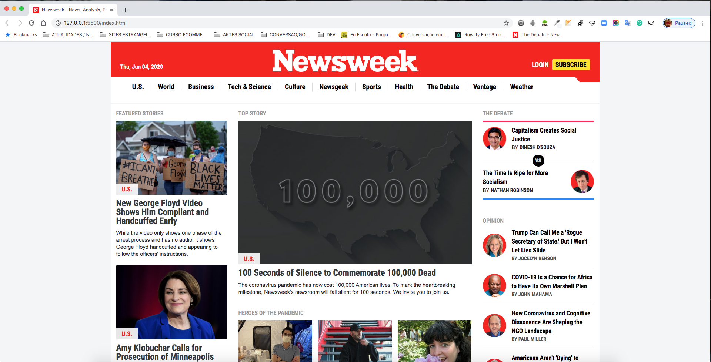

# Using Bootstrap

> This project contains a clone of Newsweek website, was done with HTML, CSS Positioning and Layout (Including Grid and Flexbox), Media Query and Bootstrap, using mobile first approach. After finish mobile first, done 768px view and 992px for better responsiveness.




# Built With #

- HTML
- CSS
- Google fonts
 
# Live Demo #
[Live Demo Link](https://vigorous-sinoussi-2475e2.netlify.app/)
 
# Prerequisites #
All Modern web browsers like:
- Chrome 
- Firefox
- Safari


## Getting Started

To get a local copy of the repository please run the following commands on your terminal:

```
$ cd <folder>
```

```
$ git clone https://github.com/luciano-ilha/Using-Bootstrap.git
```


# Author# 

👤 Luciano Ilha

 - [github](https://github.com/luciano-ilha)
 - [LinkedIn](https://www.linkedin.com/in/luciano-ilha-carbonell-188115a0/)
 - [twitter](https://twitter.com/CarbonellIlha) 


## 🤝 Contributing

Contributions, issues and feature requests are welcome!

Feel free to check the [issues page](https://github.com/luciano-ilha/Using-Bootstrap/issues).

## Show your support

Give a ⭐️ if you like this project!

## Acknowledgments

- Project originally taken from The Odin Project
- Project inspired by Microverse Program
